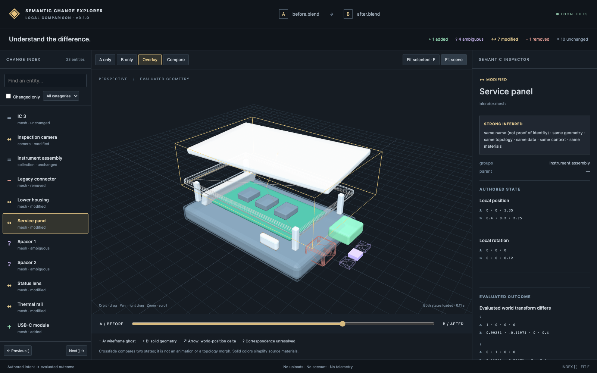

# Semantic Change Explorer

**See what changed in a structured 3D scene.** Compare two Blender files locally, inspect both states in 3D, and connect visual differences to semantic changes and correspondence evidence.



A local v0.1.0 release candidate under a provisional working name. The demo above is generated from repository code, not a mockup.

## What it does

- Arbitrary `.blend` A/B comparison, without prior snapshots or persistent IDs.
- Linked 3D/index selection, A-only/B-only/overlay/crossfade, fit and changed-entity navigation.
- Explicit inferred correspondences, probable renames and unresolved duplicate candidates.
- Authored transforms/relationships/mesh edits, sampled material/modifier fields, camera/light/custom properties, and separately evaluated geometry.
- Portable local reports with snapshots, Change IR, GLBs, coverage and timings.

This is a comprehension tool. It is not a VCS, history store, merge system, complete Blender differ or rendered-image comparison. Existing tools already cover much semantic versioning territory; see the [competitive audit](docs/competitive-audit.md).

## Install from a checkout

Requirements: Python 3.11+, Node 22.18+ (24/26 also suitable), npm, and Blender. Locally tested: Blender **4.4.0 and 4.5.14 LTS**, Python **3.14.6**, Node **26.4.0**, Chrome on macOS ARM64. The CLI accepts Blender 4.2–4.5; untested accepted versions are not a compatibility guarantee. Both tested Blender versions pass the real integration suite; see the build log.

```sh
python3 -m venv .venv
. .venv/bin/activate
python -m pip install -e .
npm ci --prefix web
python scripts/package_viewer.py
```

`package_viewer.py` builds and bundles the static viewer and third-party notices. Node is a build-time dependency; a properly built wheel includes the viewer. Blender remains separately installed. Set `BLENDER` or pass `--blender /path/to/blender` if discovery fails; the macOS `/Applications/Blender.app` location is detected automatically.

## First comparison

```sh
sce compare before.blend after.blend --output ./report
sce serve ./report --open
```

Outputs must be new paths; the CLI refuses to overwrite files/reports. The server binds loopback only. Reports need HTTP via `sce serve`, not opening `index.html` with `file://`.

## Reproduce the demo

Use your Blender executable in the first command. On macOS replace `blender` with `/Applications/Blender.app/Contents/MacOS/Blender` if necessary.

```sh
blender --background --factory-startup --disable-autoexec --python-exit-code 3 \
  --python scripts/generate_fixture.py -- --output outputs/fixture
sce compare outputs/fixture/before.blend outputs/fixture/after.blend --output outputs/demo
sce serve outputs/demo --open
```

Expected summary:

```json
{"added":1,"removed":1,"modified":7,"unchanged":10,"ambiguous":4}
```

Four ambiguous records represent two unresolved observations on each side, not four asserted edits. Select **Service panel** for movement, **Lower housing** for inferred rename/modifier/evaluated changes, and a **Spacer** for ambiguity. Use `[` / `]` to navigate changed entities, `F` to fit selection, or the equivalent buttons. The slider crossfades states; it does not reconstruct an edit animation. [Fixture details](fixtures/README.md) · [Capture procedure](docs/demo-capture.md).

## Privacy and limits

No uploads, accounts, telemetry, AI or runtime cloud dependency. Embedded auto-execution is disabled before opening each source; source hashes are verified afterward and the extractor never saves inputs. **Blender is not sandboxed**: linked resources, native-code vulnerabilities and resource exhaustion remain relevant. [Security boundary](docs/security.md).

One active scene/view layer and saved frame; index-sensitive mesh comparison; no complete shader graphs, textures, animation, rigs, constraint settings or simulation reconstruction. Preview geometry uses simplified solid materials. Camera/light/collection entries are inspectable but have no visual proxies. Matching is heuristic and can be wrong. “Unchanged” means no difference in compared fields. The 400-object benchmark is not evidence for production-size scenes. [Full semantics](docs/diff-semantics.md) · [Matching limits](docs/entity-matching.md) · [Measured performance](docs/performance.md).

## Develop and verify

```sh
python -m pip install jsonschema build
python -m unittest discover -s tests -v
SCE_INTEGRATION=1 python -m unittest discover -s tests -v
npm test --prefix web
npm run build --prefix web
# With the canonical report served at localhost:8765:
npm run test:e2e --prefix web
# Package source and wheel after staging viewer:
python -m build
python scripts/audit_release.py
```

Blender integration skips explicitly unless enabled. For browser tests outside macOS, set `CHROME_PATH` to an installed Chromium or use Playwright's CI browser setup. Developer/debug commands: `sce snapshot file.blend -o new.json`, `sce compare-snapshots a.json b.json -o changes.json`; `sce --debug ...` includes technical failure details.

Start reading: [architecture](docs/architecture.md), [guided code tour](docs/code-tour.md), [data model](docs/data-model.md), [matching](docs/entity-matching.md), [testing](docs/testing.md). Contributions: [guide](CONTRIBUTING.md). Decisions and truthful implementation history: [ADRs](docs/decisions/README.md), [build log](docs/build-log.md). Before publishing: [release checklist](docs/release-checklist.md).

## License

Project code: **GPL-3.0-or-later**. Bundled MIT dependency notices are preserved. Blender is not redistributed. [License text](LICENSE) · [licensing rationale](docs/licensing.md). No public release, hosted CI result or adoption is implied by this local candidate.
