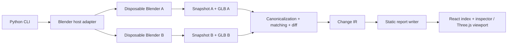
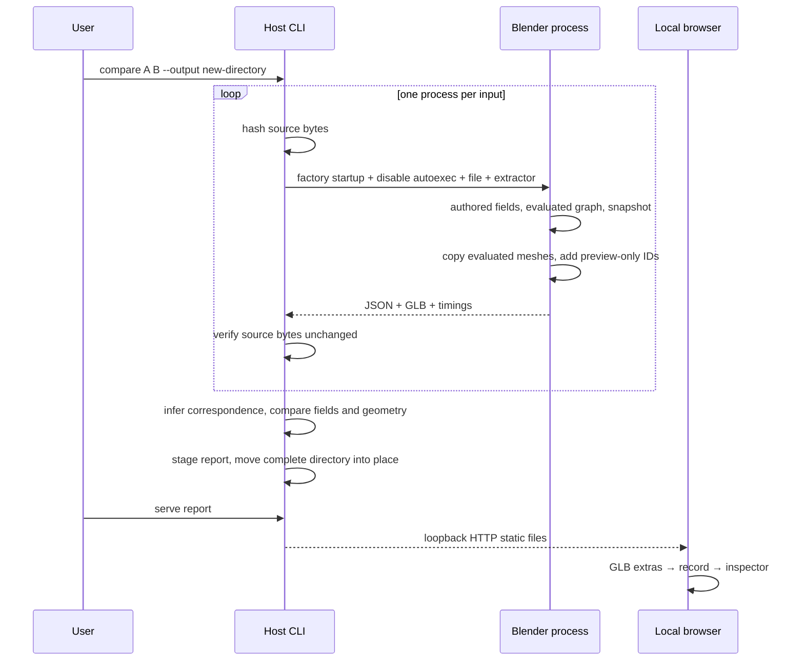

# Architecture

The boundary is a file protocol, not a shared Python interpreter. The host runs without `bpy`. Blender supplies the interpretation of its own authored scene. The browser receives static data and visual assets, not a live editing connection.

## Responsibilities and files

- `src/semantic_change_explorer/cli.py`: four commands, output protection, staging and actionable errors.
- `adapters/blender.py`: executable discovery, version gate, safe subprocess arguments, timeout, hashes, Blender-specific geometry effect comparison.
- `adapters/blender_extract.py`: the only production module importing `bpy`; self-contained because it runs in Blender's bundled Python.
- `core/model.py`: canonical numeric policy, deterministic serialization, core invariant validation.
- `core/matching.py`: partial deterministic entity correspondence from generic evidence hints.
- `core/diff.py`: coverage intersection, correspondence-normalized relationships, semantic records, optional domain effect callback.
- `report.py`: bundles local assets and serves one report root on loopback.
- `web/src/main.tsx`: React-owned selection/filter/mode state; semantic inspector and index.
- `web/src/Viewer.tsx`: owns Three resources, orbit camera, GLB mapping, raycasting, fit and appearance.
- `schemas/`: language-neutral contracts; `fixtures/`: actual JSON examples and expected IR.

The Blender extension is an explicit plugin boundary but adapter registration is currently a CLI branch, not a dynamic SDK. Matching hints are neutral named signals; their meanings and reliability depend on the adapter. This is extensibility evidence, not proof that all domains fit.

Both GLBs share one camera and coordinate frame; there is no duplicated viewport synchronization state. React owns the selected record ID. Three keeps immutable links from mesh nodes to that ID. Browser controls repaint on demand, without a continuous animation loop. Materials are cloned so A opacity does not mutate B.

The report contains `report.json` for convenient browser loading, the original snapshots, `changes.json`, `a.glb`, `b.glb`, assets, license notices and timings. This deliberately duplicates JSON for inspectability. Large-scene streaming is not implemented.

See [ADR index](decisions/README.md), [data model](data-model.md) and [code tour](code-tour.md).
