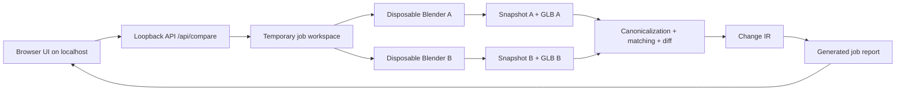
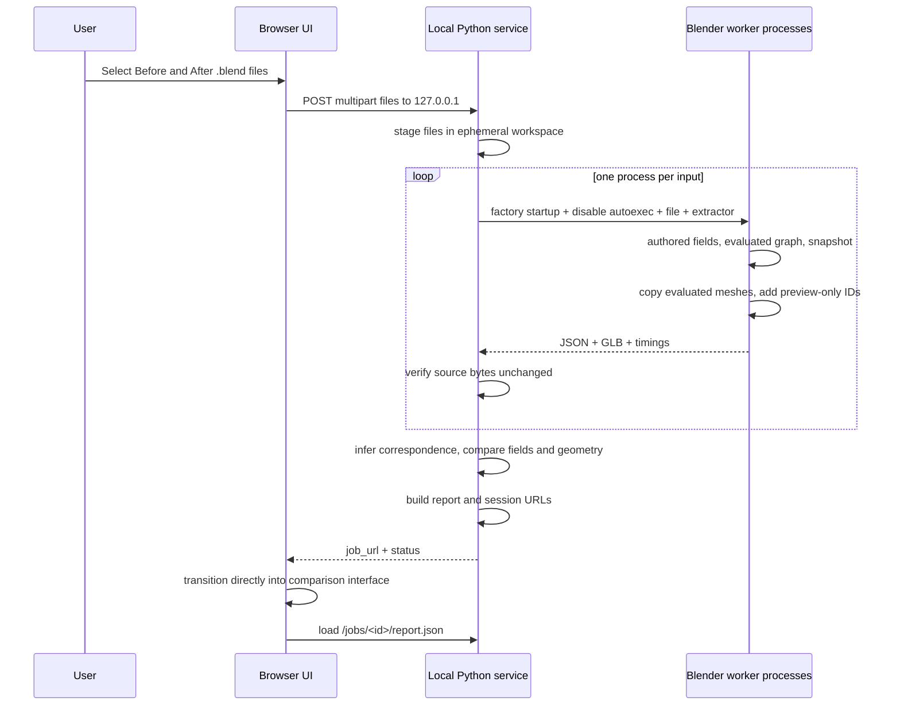

<!-- @format -->

# Architecture

The product is a browser-first local application: the user opens the app on localhost, drops in two `.blend` files, and the local Python backend performs the comparison in a temporary workspace. The browser is the ingestion and result interface; the local loopback service is the compute layer.

## Responsibilities and files

- `src/semantic_change_explorer/app.py`: browser-first local server, loopback-only compare API, temp workspace lifecycle, and job URLs.
- `src/semantic_change_explorer/cli.py`: optional headless commands for developer workflows and scripted usage.
- `adapters/blender.py`: executable discovery, version gate, safe subprocess arguments, timeout, hashes, Blender-specific geometry effect comparison.
- `adapters/blender_extract.py`: the only production module importing `bpy`; self-contained because it runs in Blender's bundled Python.
- `core/model.py`: canonical numeric policy, deterministic serialization, core invariant validation.
- `core/matching.py`: partial deterministic entity correspondence from generic evidence hints.
- `core/diff.py`: coverage intersection, correspondence-normalized relationships, semantic records, optional domain effect callback.
- `report.py`: bundles local assets and serves one report root on loopback.
- `web/src/main.tsx`: browser upload state, compare flow, and the result viewer.
- `web/src/Viewer.tsx`: owns Three resources, orbit camera, GLB mapping, raycasting, fit and appearance.
- `schemas/`: language-neutral contracts; `fixtures/`: actual JSON examples and expected IR.

The browser is both the ingestion interface and the result interface. Local Python is the compute layer. A POST to `127.0.0.1` is local processing, not a cloud upload. Selected files are transferred only to the local loopback service, processed locally in a temporary workspace, and removed after processing.

See [ADR index](decisions/README.md), [data model](data-model.md) and [code tour](code-tour.md).
